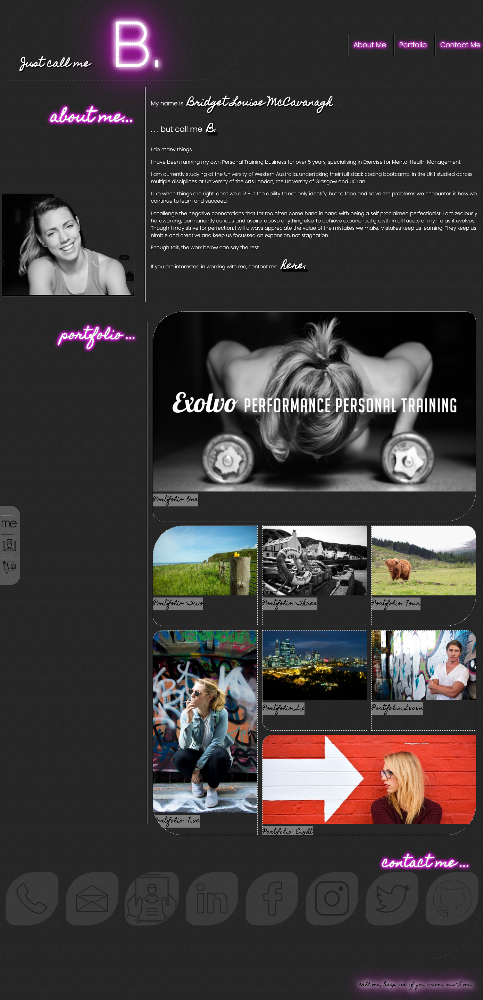
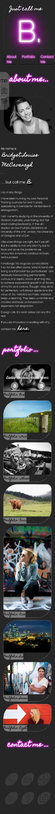

# Bridget McCavanagh - Professional Portfolio

## This Github repository contains a portfolio website containing a summary of my professional experience, a portfolio of my work and my contact information.

I was motivated to develop this website to serve as a homepage or internet presence for my work as a web developer and as a method of showcasing my developing skills with HTML and CSS, with a particular focus on providing a web standards compliant layout and a focus on accessibility, allowing users with accessibility devices to be able to utilise the website effectively.

I aim to continue to develop this website as a showcase and portfolio for my development work, with the ultimate goal of using it as a showcase for employment or contract opportunities and to provide a single location containing my work, contact details and social media presence. At present I have no specific examples of my work to showcase and as such I have used placeholder images and generic names (Portfolio: One, etc) until such time as these can be gradually updated to include direct links to my work.

In developing this website I worked to create a CSS based layout that was optimised for both desktop and mobile based view. I utilised assistance and collaboration with my developer peers to overcome some of the issues I experienced with CSS styling and adapting the website to display on mobile devices in a way that was aesthetically pleasing. I faced particular challenges when designing the layout of this page. Utilising flex and grid containers provided the most optimal tools to get this webpage to display as I wanted but getting a better understanding of these concepts in order to utilize them certainly required a high level of effort. I also wanted this webpage to be resposive to ensure a positive user experience on varying devices. To do this I used media queries within the CSS. These also provided challenges, however with dedication I was able to get the webpage to be responsive between device sizes.

In order to make the website stand out from my peers I had a particular focus on aesthetics and layout, with the goal of having a website that was pleasing to the eye, easy to navigate and consistent in its application of style and graphics. The site clearly states my professional goals, allows for a showcase of the work I am developing and allows for contact opportunities.

**Thank you for visiting.**

### Deployed Application Link:

* https://blmccavanagh.github.io/Professional-Portfolio/

### Desktop Screen Capture

### Mobile View Screen Capture

